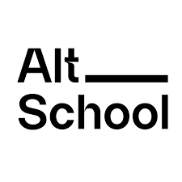

## This is Alt-school Exam Project showcasing the use of using Flask in building a blog application.

[![Contributors][contributors-shield]][contributors-url]
[![Forks][forks-shield]][forks-url]
[![Stargazers][stars-shield]][stars-url]
[![Issues][issues-shield]][issues-url]
[![MIT License][license-shield]][license-url]
[![LinkedIn][linkedin-shield]][linkedin-url]

**This project is completely done with no cheatings.**
[Please don't, fork and push back to this project.]
[AltSchool Africa](https://www.altschoolafrica.com)
**AltSchool[Class of 2022] - Software engineer**
**AltSchool** is an alternative school that helps in building people in becoming a world class techie.

```
project = 'blog application'
print(project)
```

### _What I learned during the process of building_

<ul>
    <li>Logical reasoning</li>
    <li>Flask Authentication and Authorization</li>
    <li>Jinja template</li>
    <li>Documentation</li>
    <li>Flask messaging</li>
</ul>

<br>


###Built with


